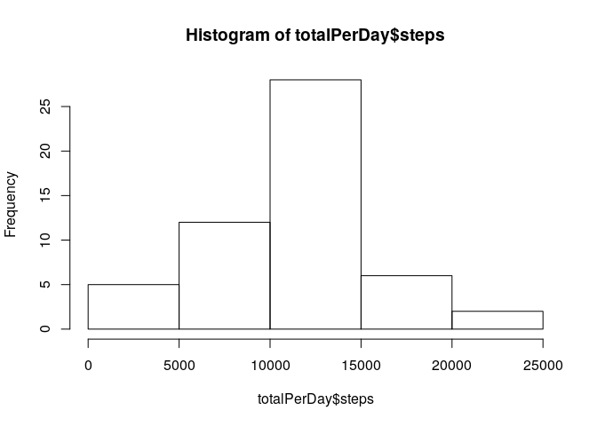
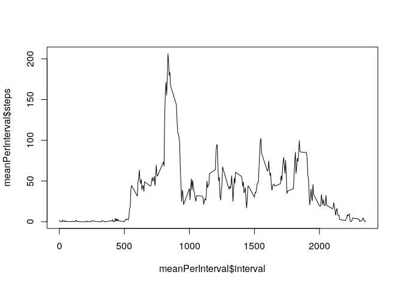
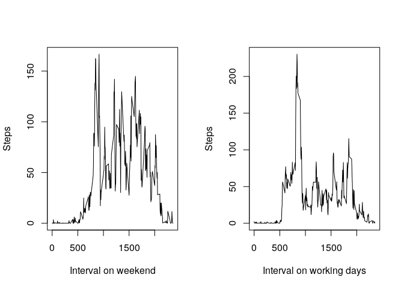

## Loading and preprocessing the data

We load necessary libraries and unzips and reads data.


```r
library(dplyr);
```

```
## 
## Attaching package: 'dplyr'
```

```
## The following objects are masked from 'package:stats':
## 
##     filter, lag
```

```
## The following objects are masked from 'package:base':
## 
##     intersect, setdiff, setequal, union
```

```r
data <- read.csv(unz('activity.zip', "activity.csv"));
```

## What is mean total number of steps taken per day?

We calculates total number of steps for each day. Missing data are simply skipped. Then we calculates mean and median of it and shows a histogram.


```r
totalPerDay <- filter(data, !is.na(steps)) %>% group_by(date) %>% summarise (steps = sum(steps));

meanSteps <- mean(totalPerDay$steps);
medianSteps <- median(totalPerDay$steps);
hist(totalPerDay$steps);
```

<!-- -->

Mean number of steps per day is 10766.2 and median number of steps per day is 10765.

## What is the average daily activity pattern?

We calculates mean number of steps for each 5-minute interval across all days and plots it.


```r
meanPerInterval <- filter(data, !is.na(steps)) %>% group_by(interval) %>% summarise (steps = mean(steps));
plot(meanPerInterval$interval, meanPerInterval$steps, type='l');
```

<!-- -->

```r
maxSteps <- max(meanPerInterval$steps);
maxInterval <-meanPerInterval$interval[meanPerInterval$steps == maxSteps];
```

The maximum mean number of steps in 5-minute interval is 835.

## Imputing missing values

If some number of steps is missing we simply takes a mean number of steps for given 5-minute interval (across all days).


```r
imputted <- data;

for (i in 1:length(imputted$steps)) {
  if (is.na(imputted$steps[i])) {
    imputted$steps[i] <- as.numeric(filter(data, !is.na(steps)) %>% filter (interval == data$interval[i]) %>% summarise (steps = mean(steps)));
  }  
}

imputted$wday <- as.POSIXlt(data$date)$wday;
imputted$weekend <- (imputted$wday == 0 | imputted$wday == 6);
```

Original data contained 2304 missing values from 17568, after imputting it contains r sum(is.na(imputted$steps))` missing values.


## Are there differences in activity patterns between weekdays and weekends?

We calculates mean number of steps for each 5-minute interval across working days and weekend and shows it in the plot.


```r
meanPerIntervalWeekend <- filter(imputted, !is.na(steps)) %>% filter(weekend) %>% group_by(interval) %>% summarise (steps = mean(steps));

meanPerIntervalWorkingDay <- filter(imputted, !is.na(steps)) %>% filter(!weekend) %>% group_by(interval) %>% summarise (steps = mean(steps));

par(mfrow=c(1,2))
plot(meanPerIntervalWeekend$interval, meanPerIntervalWeekend$steps, type='l', xlab='Interval on weekend', ylab='Steps');
plot(meanPerIntervalWorkingDay$interval, meanPerIntervalWorkingDay$steps, type='l', xlab='Interval on working days', ylab='Steps');
```

<!-- -->

We can see that in the working days the most steps are done in the morning while on the weekend the steps are spreaded more evenly (except nigth).
